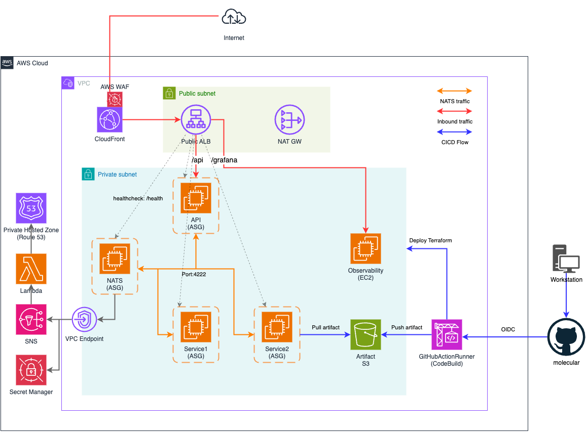

# Moleculer Framework Project on AWS

A script to provision node.js moleculer framework with NATS transporter running on AWS EC2 Autoscaling group, Managed by Hashicorp Terraform and Packer.

### Application URL: https://moleculer.panan.info/api

### Grafana URL: https://moleculer.panan.info/grafana/login

Username/Password as below

    viewer: LX$(z,[rY9qmu5U{

## Solution in detail

### Architecture Diagram

### Folder structure

    +---.github // GitHub Workflows
    |   \--workflows
    +---aws // Contain aws cli script to create prerequisite resources
    |   \---json
    +---js // Contain Application code
    +---packer // Contain Packer script use for creating an golden image AMI.
    |   +---nats
    |   +---nodejs
    |   \---obs
    +---sh // Contain shell script to which will be execute at EC2 runtime, will push to S3 by GitHub WorkFlows
    \---terraform // Contain terraform to create/manage infrastucture
        +---code // module
        |   +---module
        |   |   +---lambda
        |   |   \---user-data
        |   +---nonprod
        |   \---prod
        \---config // .tfvars

### Concept

- Leverage GitHub workflow with AWS CodeBuild to deploy Terraform infra and sync script to S3 bucket.
- Each EC2 will sync script from S3 bucket and runtime.
- Attached ASG with AWS ALB to support the healthcheck and with ability to autoscale base on CPU Utilization.

Create /health for health check on Node Js as below.

    if (req.method === "GET" && req.url === "/health") {
      res.writeHead(200, { "Content-Type": "application/json" });
      res.end(JSON.stringify({ status: "Service#1 is healthy" }));
    } else {
      res.writeHead(404, { "Content-Type": "text/plain" });
      res.end("Not Found");
    }

### Moleculer
- Leverage moleculer for service1 and service2
  - Link: https://github.com/moleculerjs/moleculer
- Leverage moleculer-web for api-service
  - Link: https://github.com/moleculerjs/moleculer-web

### NATS configuration
- Link: https://moleculer.services/docs/0.15/networking
- Leverage password authentication for communication.
- Credentials is store in SecretManager

as below

    return new ServiceBroker({ // Connect with options
      transporter: {
          type: "NATS",
          options: {
              servers: [ natsServers ],
              user: secretData.username,
              pass: secretData.password
          }
      }
    });

- NATS and Observability server will execute 01_set_hostname.sh to update the server name and push to SNS (behind is Python Lambda) to update the route53 private hostedzone records .local .
  - This will allow other nodes (API, Service1 and Service2) to reach NATS and Observability server with DNS name.
  - e.g., nats-1.local, nats-2.local and loki.local

- To allow the server to autoscale all NodeJs services will configure the NATS servers in arrays.

as below

    // Find *nats record inside Route 53
    const { stdout } = await execPromise(
      `aws route53 list-resource-record-sets --hosted-zone-id ${hostedZoneId} --query "ResourceRecordSets[?starts_with(Name, '${recordName}')] | [*].Name" --output text`
    );

    // Split the output into individual record names
    const recordNames = stdout.split("\n").filter(Boolean);

and function to refresh the NATS every 5 mins

    // Function to refresh the broker's NATS configuration
    async function refreshBrokerConfig(broker) {
        try {
            const clusterNodes = await getNatsClusterNodes();
            const natsServers = clusterNodes.map((node) => `nats://${node}:4222`).join(",");
            broker.transporter.options.url = natsServers; // Update to comma-separated string
            logger.info("NATS servers updated:", { natsServers });
        } catch (error) {
            logger.error("Failed to update NATS servers:", error);
        }
    }

### Observability stack
- Leverage Promethues, Grafana Loki and Grafana

#### Grafana to visualize the dashboard
- Grana URL: https://moleculer.panan.info/grafana/login

Username/Password as below

    viewer: LX$(z,[rY9qmu5U{

#### Prometheus for metrics

Leverage IAM role for service discovery.

    global:
    scrape_interval: 15s
    external_labels:
        monitor: 'prometheus'

    scrape_configs:
    - job_name: 'node'
        ec2_sd_configs:
        - region: $REGION
            port: 9100
            role_arn: arn:aws:iam::$ACCOUNT_ID:role/PrometheusEC2ScrapeRole

node_exporter.service is installed at AMI level (packer) and server start at start up time (ec2 user-data)

#### Grafana Loki for logging

Promtail configuration to send the log to Loki server. (This is configured at ec2 user-data which is managed by Terraform)

    server:
    http_listen_port: 3100

    positions:
    filename: /tmp/positions.yaml

    clients:
    - url: http://loki.local:3100/loki/api/v1/push

    scrape_configs:
    - job_name: system
        static_configs:
        - targets:
            - localhost
            labels:
            job: apiservice-applog
            __path__: /var/log/nodejs/app.log

Example of 01_set_hostname.sh to set hostname (For nats and loki server)

    # Retrieve the current internal IP address using ifconfig
    PRIVATE_IP=$(ifconfig enX0 | grep 'inet ' | awk '{print $2}')

    # Set the instance name and start count
    if [ "$INSTANCE_TYPE" == "nats" ]; then
        INSTANCE_NAME="nats"
    else
        INSTANCE_NAME="loki"
    fi
    COUNT=1

    # Publish both the record name and the internal IP address to SNS
    aws sns publish \
    --topic-arn "$SNS_TOPIC_ARN" \
    --message "{\"record_name\":\"$RECORD_NAME\", \"private_ip\":\"$PRIVATE_IP\"}"

# Deployment procedure

## Prerequisite

First of all, you need to have the following tools installed globally on your environment:

- Packer: https://developer.hashicorp.com/packer/tutorials/docker-get-started/get-started-install-cli
- Packer EBS plugins: https://developer.hashicorp.com/packer/integrations/hashicorp/amazon
- Git: https://git-scm.com/downloads
- AWS CLI: https://docs.aws.amazon.com/cli/latest/userguide/getting-started-install.html

#### Execute Packer to create a golden image before provisioning the infra (EC2 is not allowed to access internet during runtime)

Make sure you have configured the AWS Credential in the local workstation.
- Link: https://docs.aws.amazon.com/cli/latest/userguide/cli-chap-configure.html

Update profile name on line 7 of template.json (all 3 files) under /packer folder

    "aws_profile": "${YOUR_AWSPROFILE}"

1. Builder NodeJS golden image with Packer

Note: Packer will use default vpc for create an ec2 instance, you will have to allow your ip to access port 22 on the packer instance, (Security group will be created after execute the packer build command)

Script:

    packer build -color=true -on-error=abort "packer/nodejs/template.json"

1. Builder NATS golden image with Packer

Script:

    packer build -color=true -on-error=abort "packer/nats/template.json"

3. Builder Observability golden image with Packer

Script:

    packer build -color=true -on-error=abort "packer/obs/template.json"

#### SecretManager
- Create NATSAuth on SecretManager
    - Please make sure you have the private cert in hand.
    - Update username and password on aws/json/nats-secrets.json
    - Please make sure to change --profile "${YOUR_AWSPROFILE}".

 Command:

    aws secretsmanager create-secret \
    --profile "${YOUR_AWSPROFILE}" \
    --name NATSAuthSecret \
    --description "Secret for NATS authentication" \
    --secret-string '{
        "username": "TBC",
        "password": "TBC"
    }'

- Find and replace $ACCOUNT_ID in aws/json with Target AWS Account ID

#### Update Account ID and AMI ID on .tfvars and Backend.conf

terraform/config/value.tfvars

    region     = "TBC"
    account_id = "TBC"
    vpc_cidr   = "10.0.0.0/16"
    nodejs_ami = "TBC"
    nats_ami   = "TBC"
    obs_ami    = "TBC"
    secret_id  = "TBC

terraform/config/Backend.conf

    bucket               = "terraform-state-TBC" // Please replace account id on TBC
    workspace_key_prefix = "TBC"                 // Please replace account id on TBC
    region               = "TBC"

#### Excute Shell Script to create prerequisite resources (e.g., IAM role and S3 bucket for Terraform state)

    aws/deploy-aws.sh ${YOUR_AWSPROFILE} ${YOUR_ACCOUNT_ID}

##### Script will create resources below:
- Create CodeBuild and IAM role for CodeBuild GitHubRunner
- S3 Bucket to keep terrform state file

#### Trigger GitHub action workflows to deploy the code
- Note:
    - Terraform CICD will create an Infrastructure base on Terraform code inside /terraform folder
    - S3 CICD will push js and sh script to s3 install-artifact every git commit or trigger the GitHub WorkFlows.
    - /JS and /SH Script will be downloaded and execute at EC2 startup time.

## Documentations
- [Diagram on draw.io](https://app.diagrams.net/#G12OSwFOHrnbjM3JJASTWvJJrCUF3ujIec#%7B%22pageId%22%3A%22DVOHYMLlLg_5X8rZxYoS%22%7D)
- [NATS Architecture](https://github.com/nats-io/nats-general/blob/main/architecture/ARCHITECTURE.md)
- [NATS Exporter](https://github.com/nats-io/prometheus-nats-exporter)
- [Prometheus configuration](https://prometheus.io/docs/prometheus/latest/configuration/configuration/)
- [Monitoring-ec2-instance-using-prometheus-and-grafana](https://medium.com/@phanindra.sangers/monitoring-ec2-instance-using-prometheus-and-grafana-767aea3bbf14)
- [Promtail on EC2](https://grafana.com/docs/loki/latest/send-data/promtail/cloud/ec2/)
- [Promethus](https://moleculer.services/docs/0.14/metrics?source=post_page-----bd03ee619f00--------------------------------)
- [Github-self-hosted-runners-on-aws-codebuild](https://community.aws/content/2bIB9PhWyzDWDEqhF75fW6xJwVd/github-self-hosted-runners-on-aws-codebuild)

# Troubleshoot

curl command to verify connectivity between NATS

    [root@ip-10-0-1-146 api-service]# curl -v -X POST http://localhost:3000/api
    * Host localhost:3000 was resolved.
    * IPv6: ::1
    * IPv4: 127.0.0.1
    *   Trying [::1]:3000...
    * connect to ::1 port 3000 from ::1 port 33640 failed: Connection refused
    *   Trying 127.0.0.1:3000...
    * Connected to localhost (127.0.0.1) port 3000
    > POST /service1/action1 HTTP/1.1
    > Host: localhost:3000
    > User-Agent: curl/8.5.0
    > Accept: */*
    >
    < HTTP/1.1 200 OK
    < X-Request-ID: 829604d1-a519-4833-b0c3-5d8a74534303
    < Content-Type: application/json; charset=utf-8
    < Date: Mon, 19 Aug 2024 20:22:17 GMT
    < Connection: keep-alive
    < Keep-Alive: timeout=5
    < Content-Length: 34
    <
    * Connection #0 to host localhost left intact
    {"message":"Hello from Service#2"}

    [2024-08-19T20:44:25.536Z] INFO  api/BROKER: Moleculer v0.14.34 is starting...
    [2024-08-19T20:44:25.537Z] INFO  api/BROKER: Namespace: <not defined>
    [2024-08-19T20:44:25.537Z] INFO  api/BROKER: Node ID: api
    [2024-08-19T20:44:25.539Z] INFO  api/REGISTRY: Strategy: RoundRobinStrategy
    [2024-08-19T20:44:25.539Z] INFO  api/REGISTRY: Discoverer: LocalDiscoverer
    [2024-08-19T20:44:25.541Z] INFO  api/BROKER: Serializer: JSONSerializer
    [2024-08-19T20:44:25.548Z] INFO  api/BROKER: Validator: FastestValidator
    [2024-08-19T20:44:25.551Z] INFO  api/BROKER: Registered 13 middleware(s).
    [2024-08-19T20:44:25.553Z] INFO  api/TRANSPORTER: NATS lib version: 2.28.2
    [2024-08-19T20:44:25.553Z] INFO  api/BROKER: Transporter: NatsTransporter
    [2024-08-19T20:44:25.571Z] INFO  api/TRANSIT: Connecting to the transporter...
    [2024-08-19T20:44:25.650Z] INFO  api/TRANSPORTER: NATS client v2 is connected.
    [2024-08-19T20:44:25.659Z] INFO  api/REGISTRY: Node 'service2-node' connected.
    [2024-08-19T20:44:25.660Z] INFO  api/REGISTRY: Node 'service2' connected.
    [2024-08-19T20:44:25.661Z] INFO  api/REGISTRY: Node 'api-service' connected.
    [2024-08-19T20:44:25.662Z] INFO  api/REGISTRY: Node 'ip-10-0-1-205.ap-southeast-1.compute.internal-30769' connected.
    [2024-08-19T20:44:25.662Z] INFO  api/REGISTRY: Node 'service1-node' connected.
    [2024-08-19T20:44:25.663Z] INFO  api/REGISTRY: Node 'service1' connected.
    [2024-08-19T20:44:26.161Z] INFO  api/REGISTRY: '$node' service is registered.
    [2024-08-19T20:44:26.161Z] INFO  api/REGISTRY: 'api' service is registered.
    [2024-08-19T20:44:26.161Z] INFO  api/$NODE: Service '$node' started.
    [2024-08-19T20:44:26.161Z] INFO  api/API: Service 'api' started.
    [2024-08-19T20:44:26.162Z] INFO  api/BROKER: ✔ ServiceBroker with 2 service(s) started successfully in 592ms.
    API started.